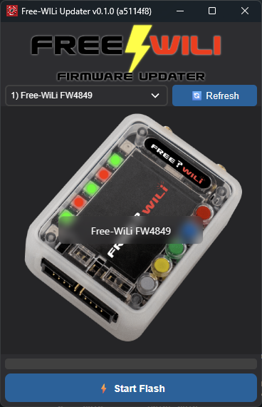

# Free-WILi Firmware Updater

A modern, cross-platform desktop application for updating firmware on Free-WILi devices, including DEF CON badges and other Free-WILi hardware. Built with Rust and Dioxus for maximum performance and reliability.

## Overview

The Free-WILi Firmware Updater provides a user-friendly interface for managing and updating firmware on Free-WILi devices. It automatically detects connected devices and guides you through the firmware update process with real-time progress tracking and detailed logging.

## Platform Support

| Platform | Support |
|----------|---------|
| Windows 32-bit | ❌ |
| Windows 64-bit | ✅ |
| Linux Deb | ✅ |
| Linux RPM | ✅ |
| Linux AppImage | ✅ |
| macOS Arm64 | ✅ |
| macOS Intel | ❌ |
| macOS Parallels | ❌ |

### Installation

Download the latest release for your platform:

## Release

- Download releases: https://github.com/freewili/freewili-updater/releases
- Update instructions:  https://docs.freewili.com/getting-started/freewili-firmware-update/

## License

MIT License - See [LICENSE](LICENSE) file for details.

## Links

- [Free-WILi Documentation](https://docs.freewili.com/)
- [Firmware Update Instructions](https://docs.freewili.com/getting-started/freewili-firmware-update/)
- [GitHub Repository](https://github.com/freewili/freewili-updater)
